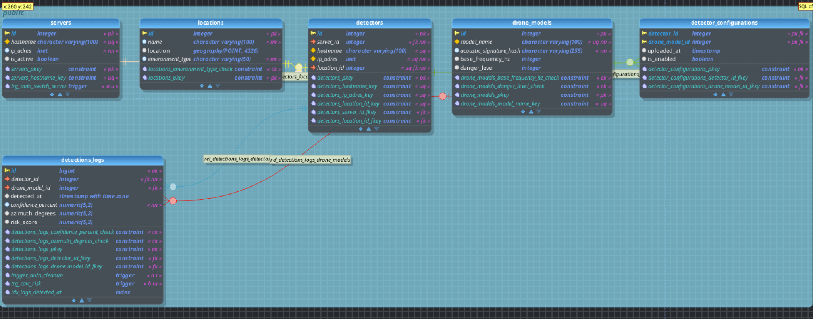

# Сергей Андреевич извините опоздал на пару часов к моменту за 3 дня до сдачи проекта приложения пока нет(

## 1. Подробное описание структуры базы данных

Творчества было много, я очень старался.

Данная база данных предназначена для хранения информации о детекторах дронов, серверах, и в целом для содержания системы(в учебных целях) обнаружения, служебная информация ивсё возможное прочее.

* **Сферы применения:** системы наблюдения за воздушным пространством, контроль зон с запретом полётов дронов.
* **Пользователи:** операторы системы, безопасники, разработчики(мы).
* **Возможные запросы:** получение логов, анализ рисков, статистика по детекторам, состояние серверов. 
* **Возможные улучшения:** К расширению системы можно будет добавить таблицы операторов разработчиков и безопасников для разграничения ролей, а также делать таблицу монтажников чтоб можно было отследить кто не правильно поставил устройство, в идеале обойтись без операторов и с применением нейронки на самом гланом сервере но это пока фантазии...
* **Ограничения:**

  * Каждая локация уникальна для детектора.
  * Датчики связаны с серверами; при отключении сервера триггер переназначает детекторы.
  * Уровень риска автоматически рассчитывается на основе уверенности и типа местности.

---

## 2. Схема базы данных

Основные таблицы:

* **servers** — список серверов системы.
* **locations** — географические точки установки детекторов с типом среды.
* **detectors** — детекторы дронов, привязанные к серверу и локации.
* **drone_models** — модели дронов с характеристиками.
* **detector_configurations** — какие модели дронов видит каждый детектор.
* **detections_logs** — логи обнаружений дронов с оценкой риска.

**индексы** применяются для оптимизации поиска (`idx_logs_detected_at`), а также для упрощения удаления последних логов.

---

## 3. SQL-код создания базы данных и таблиц

```sql

CREATE EXTENSION IF NOT EXISTS postgis; --нужно для координат(он нужны для определения насколко можно верить данным например у поля этот кэф 0.9)

CREATE TABLE servers (
	id SERIAL PRIMARY KEY,
	hostname VARCHAR(100) UNIQUE, --нот нул не нужен потомоу что как будто может быть и пустым
	ip_adres INET NOT NULL,
	is_active BOOLEAN DEFAULT TRUE
);

CREATE TABLE locations (
    id SERIAL PRIMARY KEY,
    name VARCHAR(100) NOT NULL,
	location GEOGRAPHY(Point,4326), -- координаты гпс ограничения не нужны ибо тип GOEOGRAPHY их уже накладывает (подходят только настоящие гео координаты х : -180 -- +180, у :+-90 )
    environment_type VARCHAR(50) NOT NULL CHECK (LOWER(environment_type) IN ('город', 'лес', 'поле', 'промзона', 'берег'))--lower делает не чуствительным к регистру
);

CREATE TABLE detectors (
	id SERIAL PRIMARY KEY,
	server_id INTEGER NOT NULL REFERENCES servers(id) ON DELETE RESTRICT,
	hostname VARCHAR(100) UNIQUE,
	ip_adres INET NOT NULL UNIQUE,
	location_id INTEGER NOT NULL UNIQUE REFERENCES locations(id) ON DELETE RESTRICT -- запрет на удаление локации , юник потому что если два детектора стоят близко в пределах одного места придётся создавать две строчки локации например крышадома12 ,воротадома12

);


CREATE TABLE drone_models (
    id SERIAL PRIMARY KEY,
    model_name VARCHAR(100) NOT NULL UNIQUE,
    acoustic_signature_hash VARCHAR(255) NOT NULL,
    base_frequency_hz INTEGER CHECK (base_frequency_hz > 0),
    danger_level INTEGER CHECK (danger_level BETWEEN 1 AND 5)
);


CREATE TABLE detector_configurations (
	detector_id INTEGER NOT NULL REFERENCES detectors(id) ON DELETE CASCADE,
    drone_model_id INTEGER NOT NULL REFERENCES drone_models(id) ON DELETE CASCADE, --  удаляем датчик  то эта строка удаляется автоматически.
    uploaded_at TIMESTAMP DEFAULT CURRENT_TIMESTAMP, -- если когда то не заметили дрон, а его в списке и не было показываем это и выдыхаем)
    is_enabled BOOLEAN DEFAULT TRUE,
    PRIMARY KEY (detector_id, drone_model_id)
);


CREATE TABLE detections_logs (
    id BIGSERIAL PRIMARY KEY,
    detector_id INTEGER NOT NULL REFERENCES detectors(id) ,
    drone_model_id INTEGER REFERENCES drone_models(id),

    detected_at TIMESTAMP WITH TIME ZONE DEFAULT CURRENT_TIMESTAMP, -- в иделе тут серверное время но фиг знает что может случиться, лучше дефолтное значение указать

    confidence_percent DECIMAL(5,2) NOT NULL CHECK (confidence_percent BETWEEN 0 AND 100),
    azimuth_degrees DECIMAL(5,2) CHECK (azimuth_degrees BETWEEN 0 AND 360),
	risk_score DECIMAL(5,2)
);


-- я не внимательно задание прочитал ((  сделал просто тригер а там надо ещё и чтоб поле менялось но этот удалять не хочу пусть будет
CREATE INDEX idx_logs_detected_at ON detections_logs (detected_at);
```

---

## 4. Триггеры и функции

```sql
CREATE OR REPLACE FUNCTION cleanup_old_logs()
RETURNS TRIGGER AS $$
BEGIN
    --    - записи старше 2 месяцев
    DELETE FROM detections_logs
    WHERE detected_at < NOW() - INTERVAL '2 months';

    RETURN NEW;
END;
$$ LANGUAGE plpgsql;

CREATE TRIGGER trigger_auto_cleanup
AFTER INSERT ON detections_logs
FOR EACH STATEMENT
EXECUTE FUNCTION cleanup_old_logs();
--------------------------------------------------

CREATE OR REPLACE FUNCTION switch_server_on_fail()
RETURNS TRIGGER AS $$
DECLARE
    next_server_id INTEGER;
    server_exists BOOLEAN;
BEGIN
    IF OLD.is_active = TRUE AND NEW.is_active = FALSE THEN
        next_server_id := OLD.id + 1;
        SELECT EXISTS(SELECT 1 FROM servers WHERE id = next_server_id) INTO server_exists;
        IF server_exists THEN
            UPDATE detectors
            SET server_id = next_server_id
            WHERE server_id = OLD.id;

            RAISE NOTICE 'Сервер % отключен. Детекторы переключены на сервер %', OLD.id, next_server_id;
        ELSE
            RAISE NOTICE 'ВНИМАНИЕ: Сервер % отключен, но резервный сервер % не найден! Детекторы остались без связи.', OLD.id, next_server_id;
        END IF;
    END IF;

    RETURN NEW;
END;
$$ LANGUAGE plpgsql;


CREATE TRIGGER trg_auto_switch_server
AFTER UPDATE ON servers
FOR EACH ROW
EXECUTE FUNCTION switch_server_on_fail();

--я психанул и сгенерировал функцию генерации поля с рисками чтоб точно было вычисление , вдруг вы предыдущий тригер не засчитаете
-- надеюсь она не пригодится но лучше пусть будет чем не будет

CREATE OR REPLACE FUNCTION calculate_risk_score()
RETURNS TRIGGER AS $$
DECLARE
    d_level INTEGER;
    env_type_val VARCHAR; -- Переменная для хранения типа местности
    env_coeff DECIMAL(4,2); -- Переменная для коэффициента
BEGIN
    -- 1. Получаем уровень опасности дрона
    SELECT danger_level INTO d_level
    FROM drone_models
    WHERE id = NEW.drone_model_id;

    -- 2. Получаем тип местности (environment_type)
    -- Нам нужно соединить детекторы и локации, чтобы узнать, где стоит текущий детектор
    SELECT l.environment_type INTO env_type_val
    FROM detectors d
    JOIN locations l ON d.location_id = l.id
    WHERE d.id = NEW.detector_id;

    -- 3. Определяем коэффициент в зависимости от местности (Switch Case)
    CASE LOWER(env_type_val)
        WHEN 'промзона' THEN env_coeff := 0.65; -- Много металла, эхо, помехи
        WHEN 'берег'    THEN env_coeff := 0.85; -- Шум воды, но открыто
        WHEN 'поле'     THEN env_coeff := 0.90; -- Идеальные условия
        WHEN 'город'    THEN env_coeff := 0.80; -- Отражения от зданий
        WHEN 'лес'      THEN env_coeff := 0.75; -- Деревья гасят сигнал
    END CASE;

    -- 4. Итоговый расчет
    IF d_level IS NULL THEN
        NEW.risk_score := 0;
    ELSE
        -- Формула:
        -- Уровень опасности * (Уверенность / 100) * Коэффициент местности * 10
        NEW.risk_score := d_level * (NEW.confidence_percent / 100.0) * env_coeff * 10;
    END IF;

    RETURN NEW;
END;
$$ LANGUAGE plpgsql;


CREATE TRIGGER trg_calc_risk
BEFORE INSERT OR UPDATE ON detections_logs
FOR EACH ROW
EXECUTE FUNCTION calculate_risk_score();
```

---

## 5. Вставка данных

```sql


-- === Сервера ===
INSERT INTO servers (hostname, ip_adres, is_active) VALUES
('srv1', '192.168.123.1', TRUE),
('srv2', '192.168.123.2', TRUE),--хвастаюсь у нас один на работе запущен
('srv3', '192.168.123.3', TRUE),
('srv4', '192.168.123.4', TRUE),
('srv5', '192.168.123.5', TRUE),
('srv6', '192.168.123.6', TRUE),
('srv7', '192.168.123.7', TRUE),
('srv8', '192.168.123.8', TRUE),
('srv9', '192.168.123.9', TRUE),
('srv10','192.168.123.10', TRUE);

-- === Локации (исторические башни / сооружения Пскова) ===
-- координаты настоящие можете на картах посмотреть
INSERT INTO locations (name, location, environment_type) VALUES
('Покровская башня', ST_GeogFromText('POINT(28.33383 57.80507)'), 'город'),
('Высокая башня',     ST_GeogFromText('POINT(28.34200 57.81250)'), 'город'),
('Плоская башня',     ST_GeogFromText('POINT(28.34400 57.81200)'), 'город'),
('Троицкая башня',    ST_GeogFromText('POINT(28.3290  57.8145 )'), 'город'),
('Власьевская башня', ST_GeogFromText('POINT(28.3330  57.8230 )'), 'город'),
('Рыбницкая башня',   ST_GeogFromText('POINT(28.3275  57.8290 )'), 'город'),
('Мстиславская башня',ST_GeogFromText('POINT(28.3250  57.8180 )'), 'город'),
('Кутекрома (угловая башня)', ST_GeogFromText('POINT(28.3300 57.8200 )'), 'город'),
('Устье Псковы — справа от Высокой башни', ST_GeogFromText('POINT(28.3430 57.8110 )'), 'город'),
('Запсковье — правый берег Псковы', ST_GeogFromText('POINT(28.3450 57.8135 )'), 'город');

-- === Модели дронов (реальные) ===
INSERT INTO drone_models (model_name, acoustic_signature_hash, base_frequency_hz, danger_level) VALUES
('MQ-9 Reaper',      'hash_mq9_real_001', 1000, 5),
('RQ-4 Global Hawk', 'hash_rq4_real_002',  900, 5),
('MQ-1 Predator',    'hash_mq1_real_003',  800, 4),
('RQ-7 Shadow',      'hash_rq7_real_004',  700, 3),
('RQ-11 Raven',      'hash_rq11_real_005', 600, 2),
('MQ-8 Fire Scout',  'hash_mq8_real_006',  750, 3),
('MQ-4C Triton',     'hash_mq4c_real_007', 950, 5),
('RQ-20 Puma',       'hash_rq20_real_008', 650, 2),
('RQ-170 Sentinel',  'hash_rq170_real_009', 1000, 5),
('ScanEagle',        'hash_se_real_010',   650, 2);

-- === Детекторы ===
-- Все детекторы принадлежат одному серверу псковскому остальные сервера ответственные за другие зоны
INSERT INTO detectors (server_id, hostname, ip_adres, location_id) VALUES
(1, 'det_pskov_01', '10.0.0.101', 1),
(1, 'det_pskov_02', '10.0.0.102', 2),
(1, 'det_pskov_03', '10.0.0.103', 3),
(1, 'det_pskov_04', '10.0.0.104', 4),
(1, 'det_pskov_05', '10.0.0.105', 5),
(1, 'det_pskov_06', '10.0.0.106', 6),
(1, 'det_pskov_07', '10.0.0.107', 7),
(1, 'det_pskov_08', '10.0.0.108', 8),
(1, 'det_pskov_09', '10.0.0.109', 9),
(1, 'det_pskov_10','10.0.0.110', 10);

-- === Конфигурации детекторов (какие дроны “видит” каждый датчик) ===
INSERT INTO detector_configurations (detector_id, drone_model_id, is_enabled) VALUES
(1,1,TRUE),(1,2,TRUE),(1,3,TRUE),
(2,4,TRUE),(2,5,TRUE),(2,6,TRUE),
(3,7,TRUE),(3,8,TRUE),(3,9,TRUE),
(4,1,TRUE),(4,5,TRUE),(4,10,TRUE),
(5,2,TRUE),(5,4,TRUE),(5,6,TRUE),
(6,3,TRUE),(6,7,TRUE),(6,9,TRUE),
(7,1,TRUE),(7,8,TRUE),(7,5,TRUE),
(8,2,TRUE),(8,6,TRUE),(8,10,TRUE),
(9,4,TRUE),(9,7,TRUE),(9,9,TRUE),
(10,3,TRUE),(10,5,TRUE),(10,8,TRUE);

-- === Логи обнаружений (фиктивные записи) === в пскове пока я незнаю где летали дроны(( надеюсь нигде
INSERT INTO detections_logs (detector_id, drone_model_id, detected_at, confidence_percent, azimuth_degrees) VALUES
(1, 1, NOW() - INTERVAL '10 days',  88.50, 100.00),
(2, 5, NOW() - INTERVAL '9 days',   65.00, 45.00),
(3, 7, NOW() - INTERVAL '8 days',   50.00, 200.00),
(4, 10, NOW() - INTERVAL '7 days',  92.00, 90.00),
(5, 2, NOW() - INTERVAL '6 days',   76.00, 315.00),
(6, 3, NOW() - INTERVAL '5 days',   55.00, 10.00),
(7, 9, NOW() - INTERVAL '4 days',   80.00, 270.00),
(8, 6, NOW() - INTERVAL '3 days',   70.00, 135.00),
(9, 4, NOW() - INTERVAL '2 days',   60.00, 45.00),
(10,8, NOW() - INTERVAL '1 days',   95.00, 180.00);
```

---

## 6. Хранимые процедуры и функции

```sql

-- ============================================================
--               Х Р А Н И М Ы Е   П Р О Ц Е Д У Р Ы
-- ============================================================

-- ================================================================
-- 1 — Добавление новой локации
-- ================================================================
CREATE OR REPLACE FUNCTION proc_add_location(
    p_name VARCHAR,
    p_longitude DOUBLE PRECISION,
    p_latitude DOUBLE PRECISION,
    p_environment_type VARCHAR
)
RETURNS INTEGER LANGUAGE plpgsql AS $$
DECLARE
    new_id INTEGER;
    valid_env BOOLEAN;
BEGIN
    -- Проверка валидности типа среды
    SELECT LOWER(p_environment_type) IN ('город', 'лес', 'поле', 'промзона', 'берег')
    INTO valid_env;

    IF NOT valid_env THEN
        RAISE EXCEPTION 'Недопустимый тип среды: %. Разрешено: город, лес, поле, промзона, берег',
        p_environment_type;
    END IF;

    -- Добавление записи
    INSERT INTO locations(name, location, environment_type)
    VALUES(
        p_name,
        ST_SetSRID(ST_MakePoint(p_longitude, p_latitude), 4326)::geography,
        LOWER(p_environment_type)
    )
    RETURNING id INTO new_id;

    RAISE NOTICE 'Добавлена новая локация: % (id=%)', p_name, new_id;
    RETURN new_id;
END;
$$;

-- ================================================================
-- 2 — Добавление новой модели дрона
-- ================================================================
CREATE OR REPLACE FUNCTION proc_add_drone(
    p_model_name VARCHAR,
    p_acoustic_hash VARCHAR,
    p_base_freq INTEGER,
    p_danger_level INTEGER
)
RETURNS INTEGER LANGUAGE plpgsql AS $$
DECLARE
    new_id INTEGER;
BEGIN
    IF p_base_freq <= 0 THEN
        RAISE EXCEPTION 'Base frequency must be > 0';
    END IF;

    IF p_danger_level < 1 OR p_danger_level > 5 THEN
        RAISE EXCEPTION 'Danger level must be between 1 and 5';
    END IF;

    INSERT INTO drone_models(model_name, acoustic_signature_hash, base_frequency_hz, danger_level)
    VALUES(p_model_name, p_acoustic_hash, p_base_freq, p_danger_level)
    RETURNING id INTO new_id;

    RAISE NOTICE 'Добавлена новая модель дрона: % (id=%)', p_model_name, new_id;
    RETURN new_id;
END;
$$;

---------------------------------------------------------------
-- 3 — Переназначение детекторов на другой сервер
---------------------------------------------------------------
CREATE OR REPLACE FUNCTION proc_switch_detectors(old_server integer, new_server integer)
RETURNS VOID LANGUAGE plpgsql AS $$
BEGIN
    UPDATE detectors
    SET server_id = new_server
    WHERE server_id = old_server;

    RAISE NOTICE 'Детекторы переназначены с сервера % на %', old_server, new_server;
END;
$$;


---------------------------------------------------------------
-- 4 — Вкл/Выкл модели на детекторе
---------------------------------------------------------------
CREATE OR REPLACE FUNCTION proc_set_model_enabled(det_id integer, model_id integer, enabled boolean)
RETURNS VOID LANGUAGE plpgsql AS $$
BEGIN
    INSERT INTO detector_configurations(detector_id, drone_model_id, is_enabled)
    VALUES(det_id, model_id, enabled)
    ON CONFLICT (detector_id, drone_model_id)
    DO UPDATE SET is_enabled = EXCLUDED.is_enabled,
                  uploaded_at = CURRENT_TIMESTAMP;
END;
$$;


---------------------------------------------------------------
-- 5 — Топ-N опасных событий
---------------------------------------------------------------
CREATE OR REPLACE FUNCTION func_top_risks(n integer)
RETURNS TABLE(
    log_id bigint,
    detector varchar,
    location varchar,
    drone varchar,
    risk numeric,
    detected_at timestamptz
) LANGUAGE plpgsql AS $$
BEGIN
    RETURN QUERY
    SELECT dl.id, d.hostname, l.name, dm.model_name, dl.risk_score, dl.detected_at
    FROM detections_logs dl
    JOIN detectors d ON d.id = dl.detector_id
    JOIN locations l ON l.id = d.location_id
    JOIN drone_models dm ON dm.id = dl.drone_model_id
    ORDER BY dl.risk_score DESC NULLS LAST
    LIMIT n;
END;
$$;

```

---

## 7. Представления (Views)

```sql
-- я не знаю что тут объяснять и так понятно объединённый список последних обнаружений дронов
CREATE OR REPLACE VIEW view_recent_detections AS
SELECT dl.id, dl.detected_at, dl.confidence_percent, dl.azimuth_degrees, dl.risk_score,
       d.hostname AS detector_hostname, l.name AS location_name, dm.model_name
FROM detections_logs dl
JOIN detectors d ON d.id = dl.detector_id
JOIN locations l ON l.id = d.location_id
LEFT JOIN drone_models dm ON dm.id = dl.drone_model_id;


-- детектор + инфа о нём где стоит, айдишник сервера 
CREATE OR REPLACE VIEW view_detector_overview AS
SELECT d.id, d.hostname, d.ip_adres, s.hostname AS server_hostname, l.name AS location_name, l.environment_type,
       COUNT(dc.drone_model_id) FILTER (WHERE dc.is_enabled) AS enabled_models
FROM detectors d
JOIN servers s ON s.id = d.server_id
JOIN locations l ON l.id = d.location_id
LEFT JOIN detector_configurations dc ON dc.detector_id = d.id
GROUP BY d.id, d.hostname, d.ip_adres, s.hostname, l.name, l.environment_type;
```

---

## 8. Примеры запросов к базе данных

```sql


-- ============================================================
--                         2 0   З А П Р О С О В
-- ============================================================

----------------------------------------------------------------
-- 1. Последние 10 обнаружений
----------------------------------------------------------------
SELECT * FROM detections_logs ORDER BY detected_at DESC LIMIT 10;


----------------------------------------------------------------
-- 2. Топ-5 по риску
----------------------------------------------------------------
SELECT * FROM func_top_risks(5);


----------------------------------------------------------------
-- 3. Кол-во событий у каждого детектора за 7 дней
----------------------------------------------------------------
SELECT d.hostname, COUNT(*)
FROM detections_logs dl
JOIN detectors d ON d.id = dl.detector_id
WHERE dl.detected_at >= NOW() - INTERVAL '7 days'
GROUP BY d.hostname;


----------------------------------------------------------------
-- 4. Доля событий по типам местности
----------------------------------------------------------------
SELECT environment_type, COUNT(*)
FROM detectors d
JOIN locations l ON l.id = d.location_id
JOIN detections_logs dl ON dl.detector_id = d.id
GROUP BY environment_type;


----------------------------------------------------------------
-- 5. Кол-во детекторов на серверах
----------------------------------------------------------------
SELECT s.hostname, COUNT(d.id)
FROM servers s
LEFT JOIN detectors d ON d.server_id = s.id
GROUP BY s.hostname;


----------------------------------------------------------------
-- 6. Низкая уверенность (<50%)
----------------------------------------------------------------
SELECT * FROM detections_logs WHERE confidence_percent < 50;


----------------------------------------------------------------
-- 7. Уникальные дроны, видимые каждым детектором
----------------------------------------------------------------
SELECT d.hostname, COUNT(DISTINCT drone_model_id)
FROM detectors d
LEFT JOIN detections_logs dl ON dl.detector_id = d.id
GROUP BY d.hostname;


----------------------------------------------------------------
-- 8. Логи по сектору азимута 90–180°
----------------------------------------------------------------
SELECT * FROM detections_logs WHERE azimuth_degrees BETWEEN 90 AND 180;


----------------------------------------------------------------
-- 9. Тренд за последние 14 дней
----------------------------------------------------------------
SELECT date_trunc('day', detected_at) AS day, COUNT(*)
FROM detections_logs
WHERE detected_at >= NOW() - INTERVAL '14 days'
GROUP BY day
ORDER BY day;


----------------------------------------------------------------
-- 10. Неактивные серверы
----------------------------------------------------------------
SELECT * FROM servers WHERE is_active = FALSE;


----------------------------------------------------------------
-- 11. Общая статистика логов
----------------------------------------------------------------
SELECT COUNT(*), AVG(confidence_percent), AVG(risk_score)
FROM detections_logs;


----------------------------------------------------------------
-- 12. Список детекторов с указанием сервера и локации
----------------------------------------------------------------
SELECT d.id, d.hostname, s.hostname AS server_name, l.name AS location_name
FROM detectors d
JOIN servers s ON s.id = d.server_id
JOIN locations l ON l.id = d.location_id;


----------------------------------------------------------------
-- 13. Количество включённых моделей у каждого детектора
----------------------------------------------------------------
SELECT d.id, d.hostname,
       COUNT(dc.drone_model_id) FILTER (WHERE dc.is_enabled) AS enabled_models
FROM detectors d
LEFT JOIN detector_configurations dc ON dc.detector_id = d.id
GROUP BY d.id;


----------------------------------------------------------------
-- 14. Сколько моделей назначено детектору (всего)
----------------------------------------------------------------
SELECT d.hostname, COUNT(dc.drone_model_id) AS total_models
FROM detectors d
LEFT JOIN detector_configurations dc ON dc.detector_id = d.id
GROUP BY d.hostname;


----------------------------------------------------------------
-- 15. Список детекторов и их IP
----------------------------------------------------------------
SELECT hostname, ip_adres FROM detectors;


===============================
-- Теперь 5 запросов, использующих VIEW
===============================

----------------------------------------------------------------
-- 16. (Из первого представления) Последние 10 обнаружений
----------------------------------------------------------------
SELECT *
FROM view_recent_detections
ORDER BY detected_at DESC
LIMIT 10;


----------------------------------------------------------------
-- 17. (Из первого представления) Обнаружения с уверенностью > 80%
----------------------------------------------------------------
SELECT *
FROM view_recent_detections
WHERE confidence_percent > 80
ORDER BY detected_at DESC;


----------------------------------------------------------------
-- 18. (Из второго представления) Список детекторов и число активных моделей
----------------------------------------------------------------
SELECT hostname, enabled_models
FROM view_detector_overview
ORDER BY enabled_models DESC;


----------------------------------------------------------------
-- 19. (Из второго представления) Детекторы в локациях типа "город"
----------------------------------------------------------------
SELECT hostname, location_name
FROM view_detector_overview
WHERE environment_type = 'город';


----------------------------------------------------------------
-- 20. (Из второго представления) Количество детекторов на каждом сервере
----------------------------------------------------------------
SELECT server_hostname, COUNT(*)
FROM view_detector_overview
GROUP BY server_hostname
ORDER BY COUNT(*) DESC;
```

Приложения пока нет но если я успею к пятнице будет спасибо за терпимость нас всех, за себя скажу я старался 

---

**Дата:** 2025-12-10 2:21
